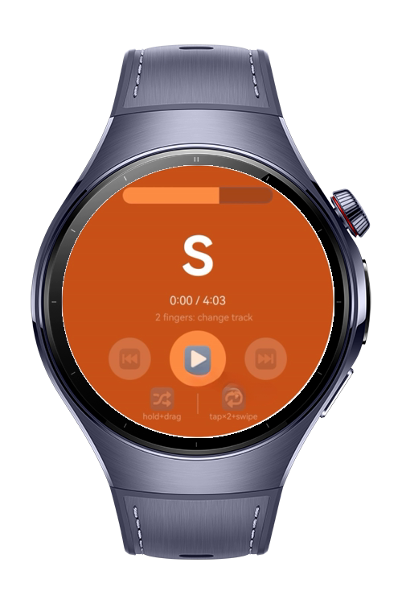
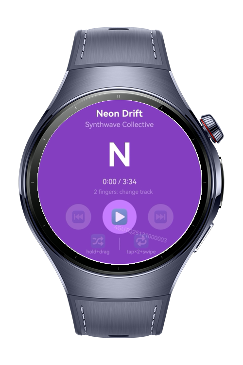
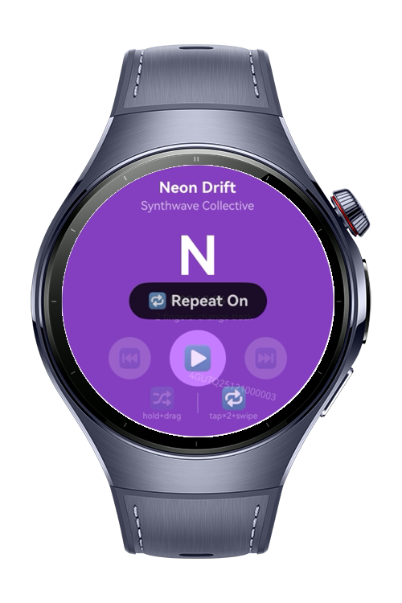
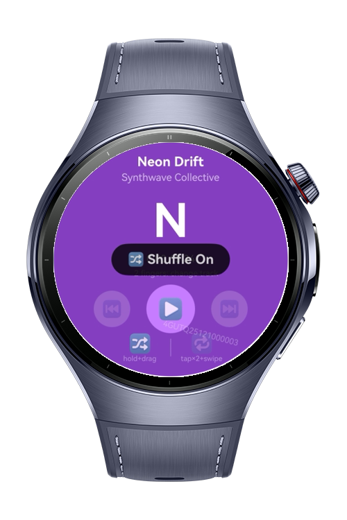

> **Note:** To access all shared projects, get information about environment setup, and view other guides, please visit [Explore-In-HMOS-Wearable Index](https://github.com/Explore-In-HMOS-Wearable/hmos-index).

# How to Build Crown Gesture Navigator
This codelab shows how to combine five ArkUI gesture modules in a single wearable app. You'll learn how to capture digital crown rotation events for volume control, detect two-finger rotation gestures for track navigation, compose multi-phase gesture sequences for quick actions, bind gestures to specific UI zones, and process gesture callbacks through dedicated handler classes.

# Preview

<div>
  
  
  
  
</div>

# Use Cases

- Control volume by rotating the digital crown
- Change tracks by rotating two fingers on the screen
- Toggle shuffle mode with a long-press and drag gesture
- Toggle repeat mode with a double-tap and swipe gesture
- Isolate gesture recognition to specific UI zones to avoid accidental triggers

# Tech Stack

- **Languages**: ArkTS, TypeScript
- **Framework**: HarmonyOS SDK 6.0.1
- **Tools**: DevEco Studio 6.0.1 Release
- **Libraries**: @kit.ArkUI, @kit.AudioKit, @kit.CryptoArchitectureKit

# Directory Structure

```
entry/src/main/ets/
|---pages
|   |---Index.ets
|
|---viewmodel
|   |---PlayerViewModel.ets
|
|---handler
|   |---CombinedGestureHandler.ets
|   |---RotationHandler.ets
|
|---model
    |---PlayerData.ets
    |---TrackDirection.ts
    |---CombinedAction.ts
```

# Constraints and Restrictions

## Supported Devices
- Huawei Watch Watch 5

# LICENSE

How to Build Crown Gesture Navigator is distributed under the terms of the MIT License.
See the [LICENSE](/LICENSE) for more information.
